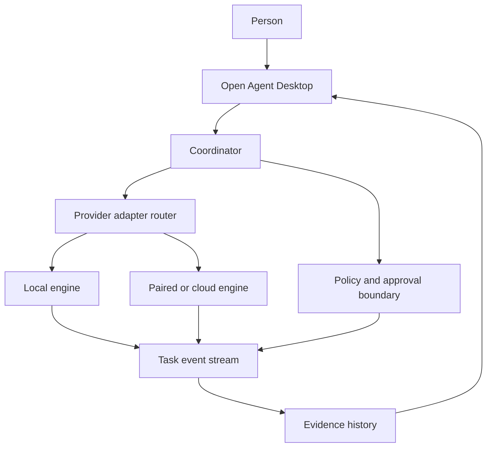

# Open Agent Desktop

Open Agent Desktop is a local-first workspace for putting specialised agents
to work as a team. You define the roles, give each one a narrow job, assign a
task, and watch the work move through a visible approval and evidence trail.

It is designed for people who already use AI tools on their computer and want
one calm place to coordinate them. Your provider login stays with you; the
desktop app supplies the workspace, routing, permissions, and history.

## The product in one minute

```text
  describe an outcome
          │
          ▼
  assemble a team of agents ──► assign a task
          │                         │
          ▼                         ▼
  review capabilities          observe progress
                                    │
                                    ▼
                         approve actions and inspect evidence
```

An agent has a role, instructions, skills, a provider, and a working context.
A team is a reusable group of agents. A task is the unit of work that records
who was asked, what happened, which actions needed approval, and what was
completed.

## What makes it different

- **Team canvas:** organise agents around an outcome instead of opening a new
  chat for every prompt.
- **Provider adapters:** use supported local CLIs or compatible engines without
  giving the desktop a second copy of your credentials.
- **Action boundary:** shell, file, browser, and connected-app actions surface
  as decisions you can allow, deny, or answer.
- **Evidence-first history:** streamed activity, approvals, tool results, and
  final answers stay attached to the task that produced them.
- **Two operating modes:** run the workspace on this Mac, or pair a desktop
  client with another approved host.
- **Portable teams:** share role definitions and skills without exporting
  transcripts, keys, or computer access.

## A small architecture



The React interface renders the task workspace. A small local harness owns
provider processes and normalises their events. The coordinator schedules team
work; the policy boundary prevents an agent from silently taking a sensitive
action. The desktop never needs to be a hosted control plane for local work.

## Try it from source

The easiest path for a first-time contributor is the [plain-language developer
guide](docs/developer-guide.md). It explains what each command does and how to
recover when something is not running.

```sh
git clone https://github.com/ashish993/open-agent-desktop.git
cd open-agent-desktop
corepack enable
pnpm install

# Terminal 1: local harness
pnpm dev:server

# Terminal 2: browser workspace
pnpm dev
```

Open <http://127.0.0.1:5199/>. To use real providers, install and sign in to
at least one supported engine on your own machine. A provider is optional for
exploring the interface and running the local test fixtures.

## Install on macOS

Prebuilt macOS installers are published on the [latest GitHub
Release](https://github.com/ashish993/open-agent-desktop/releases/latest):

- [Apple Silicon (ARM64)](https://github.com/ashish993/open-agent-desktop/releases/latest/download/Open-Agent-Desktop-0.1.88-arm64.dmg)
- [Intel (x64)](https://github.com/ashish993/open-agent-desktop/releases/latest/download/Open-Agent-Desktop-0.1.88-x64.dmg)

Choose ARM64 for Apple Silicon Macs (M1, M2, M3, or M4) and x64 for Intel
Macs. Open the downloaded DMG, drag Open Agent Desktop to Applications, and
launch it from there. These community packages are ad-hoc signed rather than
Apple Developer ID signed and notarized, so macOS may ask you to confirm the
first launch under **System Settings → Privacy & Security**. The release page
contains SHA-256 checksums and the exact build metadata.

## Verify a change

```sh
pnpm typecheck
pnpm lint
pnpm test
pnpm build
pnpm check:branding
```

Build commands create local packages under `release/`. Public installers are
published as GitHub Release assets; they are not stored in the Git history.

## Project map

| Area | Purpose |
| --- | --- |
| `src/` | Workspace UI, task views, settings, and client state |
| `server/` | Harness API, provider adapters, task execution, and approvals |
| `shared/` | Contracts used by both browser and server |
| `electron/` | Desktop shell and native capabilities |
| `docs/` | Guides, design notes, verification records, and release procedures |
| `scripts/` | Build, branding, packaging, and verification checks |

## Project status

This is an active open-source build. The local workflow is exercised end to
end; hosted deployment, signed public installers, and automatic update feeds
remain release work. Read the [release checklist](docs/product-hunt-launch.md)
before distributing a package to people who are not contributors.

## License and acknowledgements

See [LICENSE](LICENSE), [NOTICE](NOTICE), and [LICENSING.md](LICENSING.md) for
license terms and third-party notices. Open Agent Desktop is an independent
project and is not affiliated with any AI provider.
